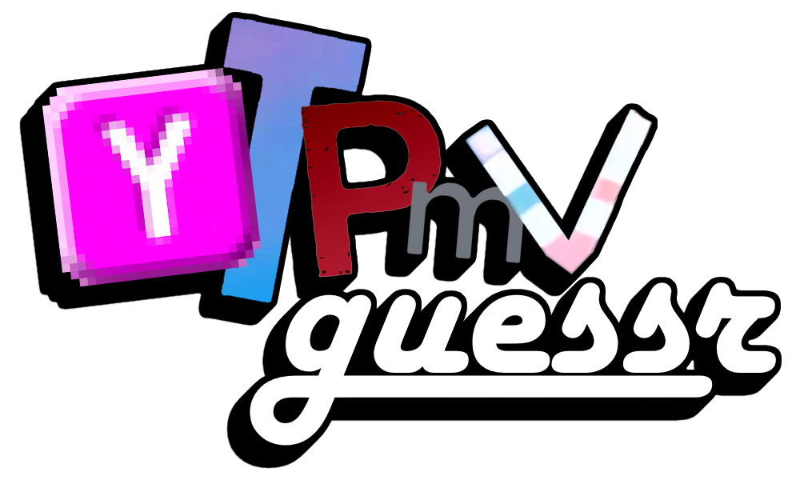

# 📻 YTPMV guessr

> *A guessing game with YTPMV and 音MAD!*

## 🛠️ Features

The game will choose a random YTPMV or 音MAD from [otodb.net](https://otodb.net), and the goal is to find the sources and the songs composing it. The more elements you find, the more points you earn. The game includes multiple settings:

- 🚫 A toggle for safe mode that hides potential sensible content.
- 👁️ Toggles that can show or hide additional information (title, creators, and platform).
- 🚩 Three difficulties : easy, medium, and hard.
- ☠️ A death match mode, one mistake and the game ends.
- ✨ A maximum number of rounds, ranging from 3 to 25.
- ⏱️ A timer, ranging from none to 10 minutes.

## 📄 License

Everything is explained in [LICENSE](./LICENSE).